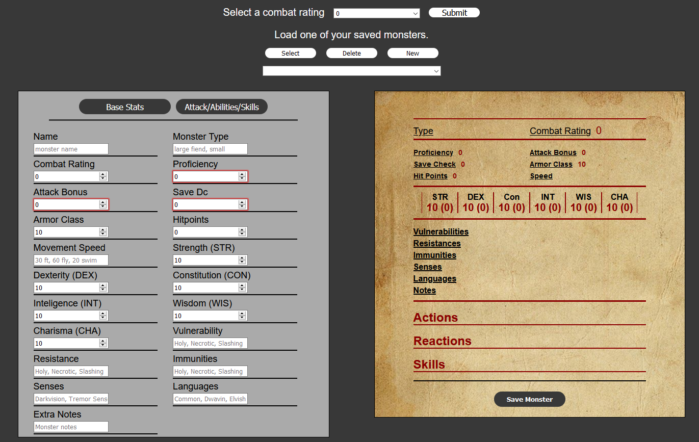

This project was bootstrapped with [Create React App](https://github.com/facebook/create-react-app).

# Application Details

`Name:` Dnd Monster Creator.  

`Description:` This tool allows the user to create a Dungeons and Dragons monster with some assistance.  
Suggestions are provided for the user to allow them a good starting point for their monster.

`Live Link:` [Dnd Monster Creator Link](https://dnd-monster-creator.vercel.app/application)

`Technology:` Html, CSS, Javascript, React framework.

